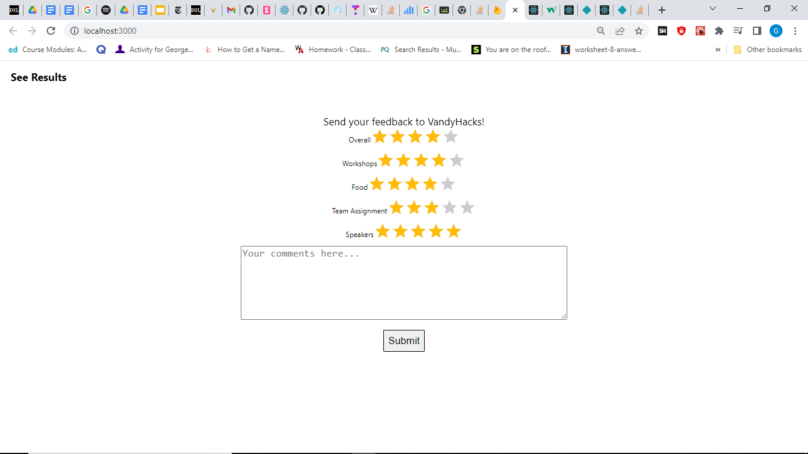
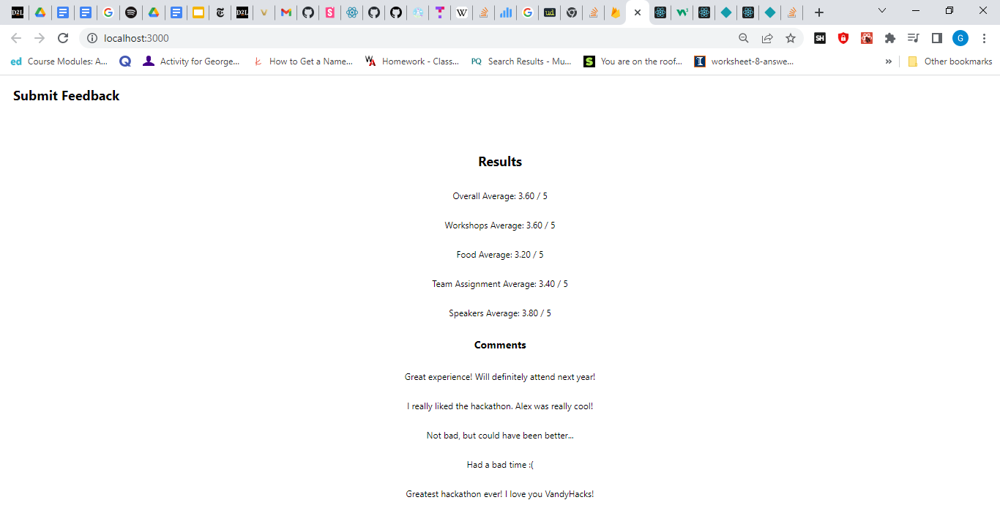

# Hi VandyHacks!

This is my application project. It is intended to provide an easy way for hackathon attendees to submit feedback and for VandyHacks to analyze the results. You can submit feedback on the main page and view the results by clicking the text in the top left. When feedback is submitted, each review will be added to a Firebase databse. Then when you view the results page, the app will calculate the average rating for each category.

Here is a video demonstration of the project: https://drive.google.com/file/d/1lT7VO8m_bmUUs3RQMKoWW1bwzjGg6KpV/view?usp=sharing

Here is a screenshot of the feedback submission page:

Here is a screenshot of the results analysis page:

My comments on this project
Did you enjoy this challenge?
Absolutely, I love making mini apps like this in my free time!

What else were you thinking when implementing your idea?
I was just trying to make sure everything was readable and understandable in the code. 

George Wang
